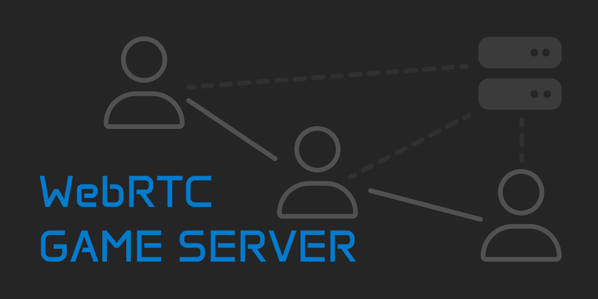

<p align="center">
  
</p>

# WebRTC Game Server

**WebRTC Game Server** is the final project of my college degree in Video Game Design and Development.

**Abstract**<br>
A significant percentage of today's video games are both multiplayer and indie. However, this category encompasses projects with significant differences in various aspects such as available resources. Additionally, thanks to technological advancements, the world of game development is now open to anyone with access to a laptop. Nevertheless, in many cases, these developers may not have the resources to rent servers on services like AWS or they simply do not consider it worthwhile for some of their games. This project aims to create a tool that simplifies the development of custom server applications suitable for any project. This tool is also meant to reduce the server’s work load, enabling the use of machines with fewer resources or saving on server rental fees. As a result of the project, a GitHub repository will be published with the intention that it can be cloned and used as a foundation for other Node.js projects. This project will function thanks to WebRTC, which allows the server , upon connecting to the game in question, to allocate a room in which one of the clients will manage the game traffic thereby replacing the central server and simplifying its functions. Thanks to this project, other developers will be able to streamline the implementation of a room-based multiplayer system based on web technologies with reduced or even zero costs, as many server rental services offer free usage depending on their usage.

The full [paper](./FinalPaper_JavierIregui.pdf) is available in Spanish.

This repository contains the project along with a website to test its functionality.

## Features

- **Server logic**
- **Game Room** System
- Socket.io **signaling server** to create the WebRTC connections
- **Real time communication** among players

## Future Features

At the moment, there are no plans to introduce any new features.
I might fix the issues found on the example website.

## Usage Instructions

### 1. Clone this repository

```bash
git clone https://github.com/JavIregui/WebRTCgameServer.git
```

### 2. Assing a room to the client

Redirect the user to ``/room/<roomCode>``.
This happens automatically when redirected to ``/findRoom``, ``/createRoom`` or ``joinRoom`` first.

In the example website, all of this is already implemented in ``views/index.ejs`` and **this can be tweaked into a menu for any other game**.

### 3. Connect to the room

Once redirected to ``/room/<roomCode>`` it will **render the file specified in the router** inside of ``routes/router.js``.

In this case, it renders ``room.ejs`` and it **can be tweaked into any game** using the HTML canvas, for example.

The **connection to the room** itself happens because the room file must use the ``connection.js`` script.

```html
<script defer src="../resources/js/connection.js"></script>
```

It will also need a **Socket.io connection**.

```html
<script defer src="/socket.io/socket.io.js"></script>
```

This will **connect the new user to the rest of the room users** and it will stop needing the server itself.

### 3. Send messages through the room

Once in the room, the player will need to **communicate with the rest of the players** in the room.

There is an example of this in ``messages.js``

```js
if(!window.isHead){
    sendLocalUpdate(data);
} else {
    broadcast(gameState);
}

if(window.isHead){
    // The Head of the room modifies the gameState of the previous frame
}
```

## License

This project is protected by license.

#

**WebRTC Game Server** is a project developed by Javier Iregui, 2023.


